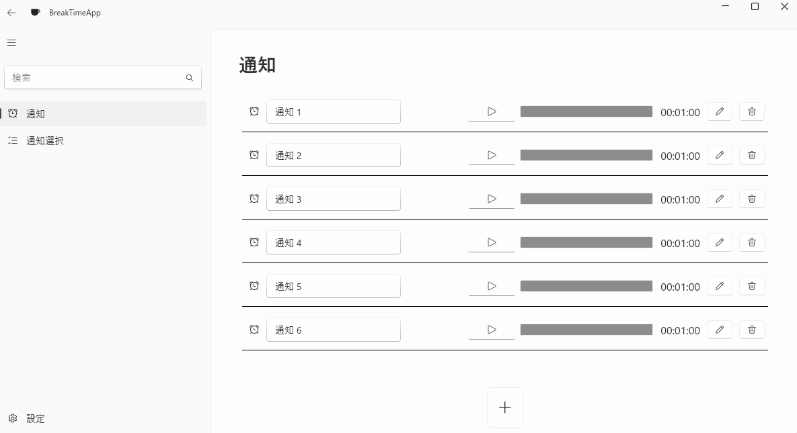

# BreakTime
一定時間後に通知する常駐アプリ

## ダウンロード
[こちら](https://github.com/mi8bi/BreakTime/releases/latest)のAssets > zipファイルからダウンロードできます。

# スクリーンショット

## 

# 必要条件

  - Windows10 1809以降
  - .NET Runtime 8.0
    - https://dotnet.microsoft.com/ja-jp/download/dotnet/8.0 
  
# 使い方

1. 「通知」メニューを選択
2. ∔ボタンを押下し通知を登録    
3. ▷ボタンを押下し通知のタイマーをスタート
4. タイマーが0になると通知が行われる

## 通知方法

### デスクトップ通知
Windowsの通知機能を使用してトースト通知を行います。   

### 全画面表示
画像ファイルを使用して全画面表示します。    

## 終了方法
Windowsのタスクトレイから本アプリを右クリックして終了します。

# ライセンス情報
MIT License

Copyright (c) 2024 mi8bi
