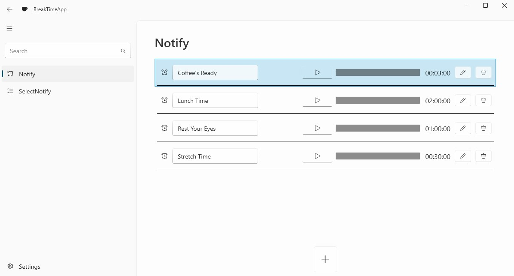
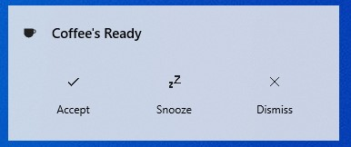

# BreakTime
A resident app that notifies you after a certain period of time

## Download
you can download it here [here](https://github.com/mi8bi/BreakTime/releases/download/v0.1.1-alpha/BreakTimeApp-v0.1.1-alpha.zip)

# Screenshots

## 

## 

# Requirements

  - Windows 10 version 1809 or later
  - .NET Runtime 8.0
    - https://dotnet.microsoft.com/ja-jp/download/dotnet/8.0 
  
# Usage

1. Select the "Notify" menu.
2. Press the ∔ button to add a notification.
3. Press the ▷ button to start the notification timer.
4. When the timer reaches zero, a notification will be displayed.

## Notification Methods

### Desktop Notification
Uses Windows' notification feature to display toast notifications.   

### Full-Screen Notification
Displays a full-screen image as a notification.

## How to Exit
Right-click the app icon in the Windows task tray and select "Exit".

# License Information
MIT License

Copyright (c) 2024 mi8bi
